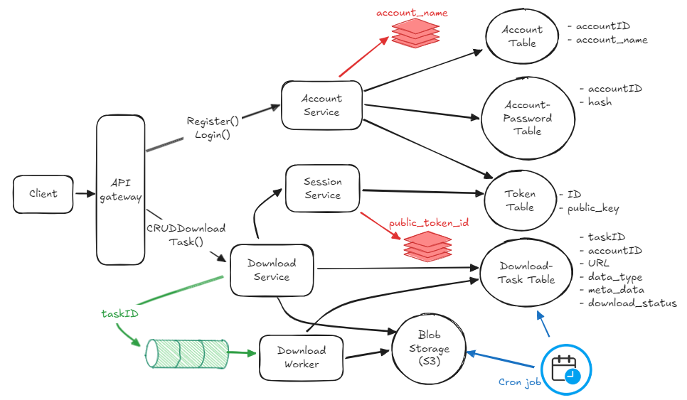

# Golang-based download manager
GoLoad is a robust and efficient download manager built in Golang, designed for seamless file downloading and management. It operates as a standalone server, integrating:

- gRPC and HTTP servers for handling diverse API requests.
- Cron jobs for scheduled download tasks.
- Message queue consumers for reliable and asynchronous task processing.

## Services Overview

- Account Service
- Session Service
- Download Service
- API gateway

## Tech Stack

The technologies used in this project are:

- Golang
- MySQL
- Kafka
- Redis
- Docker
- S3

## Application Architecture



## How to Run GoLoad

To get GoLoad up and running, follow these steps:

### Prerequisites

Before running the application, ensure you have the following installed:

- [Go](https://golang.org/dl/) (version 1.18 or later)
- [Docker](https://www.docker.com/get-started)
- [Docker Compose](https://docs.docker.com/compose/install/)
- [MySQL](https://www.mysql.com/)
- [Kafka](https://kafka.apache.org/)
- [Redis](https://redis.io/)
- [AWS S3 credentials](https://aws.amazon.com/s3/) (if using S3 for file storage)

or you can set up with docker.

### 1. Clone the Repository

First, clone the GoLoad repository to your local machine:
```
git clone https://github.com/Khanh-21522203/GoLoad
cd goLoad
```
### 2. Docker Setup
Run the application using Docker Compose. This will start the necessary services like MySQL, Kafka, Redis, and GoLoad:
```
docker-compose up
```
### 3. Run the application
run-standalone-server:
```
go run cmd/goload/main.go standalone-server
```
